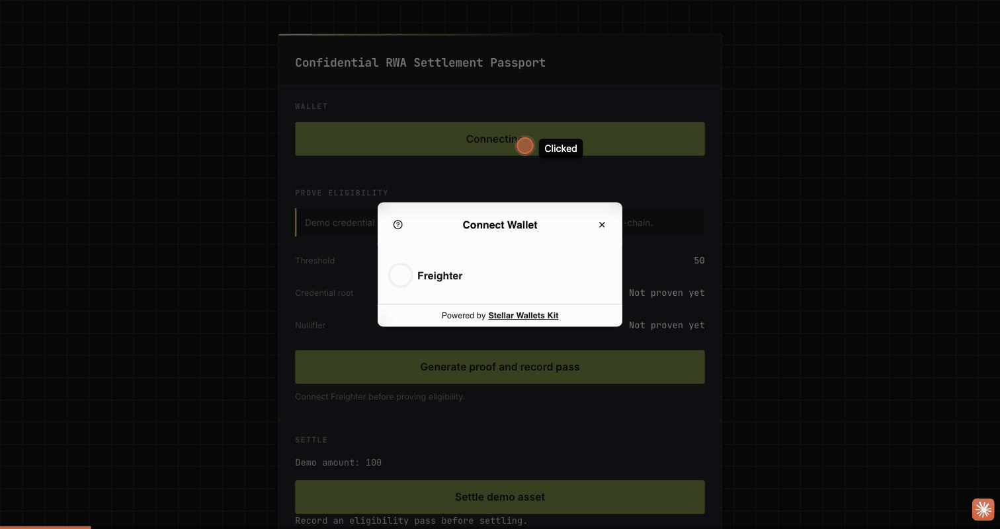

# Confidential RWA Settlement Passport

A production MVP built for **Level 4 – Green Belt** of RiseIn's [Stellar Journey to Mastery](https://www.risein.com/programs/stellar-journey-to-mastery-monthly-builder-challenges) monthly builder challenge.

A buyer proves, entirely in their own browser, that they satisfy a private eligibility predicate (credential membership + a reserve/risk threshold) **without revealing the underlying private values** — and that proof gates a real Stellar testnet asset settlement. No document upload, no compliance dashboard: the zero-knowledge proof itself is the gate.

**Live demo:** https://rwa-settlement-passport.pages.dev



Also recorded: [replay-guard rejection on an already-used nullifier](demo-recordings/prove-eligibility-and-settle-replay-guard.gif) — proving the boundary case, not just the happy path.

## The core claim, proven for real

- **The ZK proof is genuinely load-bearing.** A Soroban contract state change (a settlement-pass receipt, then a gated asset transfer) only happens after a real proof has been verified on-chain — not a UI-only check.
- **Proof generation runs entirely client-side**, in the browser, via [`@noir-lang/noir_js`](https://www.npmjs.com/package/@noir-lang/noir_js) + [`@aztec/bb.js`](https://www.npmjs.com/package/@aztec/bb.js) (WASM). Nothing private ever leaves the user's machine.
- **Verification happens on-chain.** `receipt_gate.record_pass` makes a real cross-contract call into a deployed UltraHonk verifier contract's `verify_proof`, passing the actual proof bytes and public inputs generated in the browser. The receipt is only recorded, and the settlement only executes, if that on-chain verification call succeeds.
- **Each real user gets their own nullifier.** The demo credential is shared (there's no credential-issuance backend yet — see Limitations), but the private `action_hash` is derived per-wallet-address, so many different real users can each complete the flow exactly once, independently. This was a real bug caught and fixed during development — see [`proof/INTEGRATION_LEDGER.md`](proof/INTEGRATION_LEDGER.md).
- **Live usage analytics.** A small Cloudflare Pages Functions + KV backend (`functions/api/track.ts`, `functions/api/stats.ts`) records real wallet-connect / proof / settlement / feedback events and displays them live in the app's "Live Usage" panel.

## Deployed contracts (Stellar Testnet)

| Contract | ID |
|---|---|
| `receipt_gate` | [`CB5G2NISIP3A4BCI3QTMZLBKCVIOFG73BCQN6KRPV32RE5I3PJYQ4VRH`](https://stellar.expert/explorer/testnet/contract/CB5G2NISIP3A4BCI3QTMZLBKCVIOFG73BCQN6KRPV32RE5I3PJYQ4VRH) |
| `settlement` | [`CBDPRF4V3FMRYDAKAVPGJYXBRM5YEH6TUNA5YEFUJHSFVU7FHFDGXJES`](https://stellar.expert/explorer/testnet/contract/CBDPRF4V3FMRYDAKAVPGJYXBRM5YEH6TUNA5YEFUJHSFVU7FHFDGXJES) |
| UltraHonk verifier | [`CBQZAQXEOQMMMEHS2VEMU5IT5X75ERNYWQ2RDQJWM4DYD7ZRT2MNLPLW`](https://stellar.expert/explorer/testnet/contract/CBQZAQXEOQMMMEHS2VEMU5IT5X75ERNYWQ2RDQJWM4DYD7ZRT2MNLPLW) |

### Real transactions (all verifiable on Stellar Expert)

| Step | Tx hash |
|---|---|
| CLI verification: `record_pass` | [`a80091aaa282817b4bebe8fc12eab59cda85dd4e7dd5c4dbc59e621feb99cd93`](https://stellar.expert/explorer/testnet/tx/a80091aaa282817b4bebe8fc12eab59cda85dd4e7dd5c4dbc59e621feb99cd93) |
| CLI verification: `settle` | [`5d4719314ca1cd343d711144f640a89ad3c7642a74cba3b8ecc60b7c08540378`](https://stellar.expert/explorer/testnet/tx/5d4719314ca1cd343d711144f640a89ad3c7642a74cba3b8ecc60b7c08540378) |
| Fresh-wallet full success: `record_pass` (on-chain verified) | [`d3dee7864069eb00fc4ba7a14226631a742697dd2ae7303e0e7ce6d26a82f15b`](https://stellar.expert/explorer/testnet/tx/d3dee7864069eb00fc4ba7a14226631a742697dd2ae7303e0e7ce6d26a82f15b) |
| Fresh-wallet full success: `settle` | [`6bc5a17421545f7e053adf962caf4d8ee1bb6161146fe1948025109b72840f53`](https://stellar.expert/explorer/testnet/tx/6bc5a17421545f7e053adf962caf4d8ee1bb6161146fe1948025109b72840f53) |

`settle` calls with no matching receipt (`Error(Contract, #4)`) and replayed nullifiers (`Error(Contract, #3)`) are both rejected — proven on testnet, not simulated. Full evidence log in [`proof/INTEGRATION_LEDGER.md`](proof/INTEGRATION_LEDGER.md) and [`proof/RESOURCE_PREFLIGHT.md`](proof/RESOURCE_PREFLIGHT.md).

## How it works

```
circuits/settlement_passport/   Noir circuit: Merkle membership (Pedersen hash)
                                  + reserve/threshold check + nullifier
contracts/receipt_gate/
  contracts/receipt_gate/       calls the UltraHonk verifier contract to check
                                  the proof, then records a settlement-pass
                                  receipt; rejects bad proofs and duplicate
                                  nullifiers
  contracts/settlement/         gates a demo tokenized-asset transfer behind
                                  a real inter-contract call into receipt_gate

functions/api/
  ├── track.ts             # Pages Function: records a real usage event to KV
  └── stats.ts              # Pages Function: aggregates events for the UI panel

src/
├── lib/
│   ├── proof.ts        # in-browser Noir proof generation (noir_js + bb.js)
│   ├── action.ts        # per-wallet action_hash/action_id derivation
│   ├── contract.ts      # record_pass / settle / balance against testnet
│   ├── analytics.ts      # fire-and-forget event tracking → /api/track
│   ├── errors.ts         # XDR error decoding → human-readable messages
│   └── wallet-kit.ts     # Freighter connect via Stellar Wallets Kit
└── components/            # WalletConnect, ProveEligibilityPanel, SettlePanel,
                             BalanceDisplay, TxStatus, FeedbackForm, AnalyticsPanel
```

**Flow:** connect Freighter → click "Generate proof and record pass" (the browser generates a real Noir/UltraHonk proof, which takes a few seconds — watch the loading state) → `receipt_gate` verifies the proof on-chain against the deployed UltraHonk verifier contract and records a receipt → click "Settle demo asset" → `settlement` calls `receipt_gate.get_receipt_for_action` and only then executes the transfer → balance updates.

## Limitations (honestly disclosed)

- **Shared demo credential.** There's no credential-issuance backend yet — every user proves against the same fixed demo leaf (a real issuer-per-user credential tree is Level 5+ scope). The nullifier is still unique per wallet, so each real user can still complete the flow exactly once.

## Setup — run it locally

**Prerequisites:** Node.js 18+, [Freighter](https://www.freighter.app/) on testnet with testnet XLM.

```bash
npm install
npm run dev
```

Talks directly to the deployed contracts above — no redeploy needed.

**Build & test**

```bash
npm run build
npm test
```

## Feedback

After trying the demo, please leave feedback here: **https://forms.gle/tahNmZ7aWskJo5TP9** (name, wallet address, rating, comments — takes about a minute). See `proof/INTEGRATION_LEDGER.md` for the full development and verification history.
