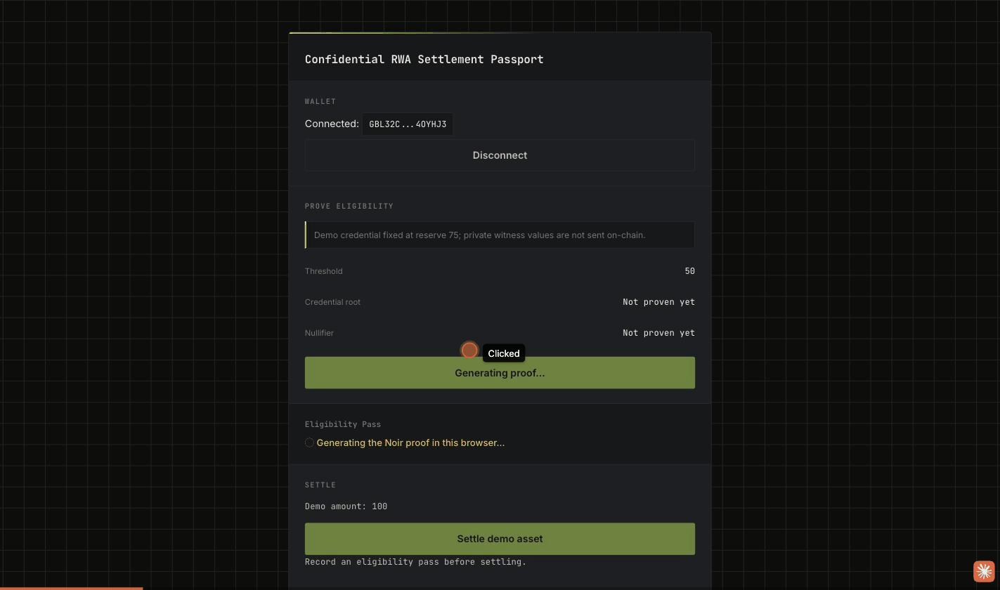

# Confidential RWA Settlement Passport

A production MVP built for **Level 4 – Green Belt** of RiseIn's [Stellar Journey to Mastery](https://www.risein.com/programs/stellar-journey-to-mastery-monthly-builder-challenges) monthly builder challenge.

A buyer proves, entirely in their own browser, that they satisfy a private eligibility predicate (credential membership + a reserve/risk threshold) **without revealing the underlying private values** — and that proof gates a real Stellar testnet asset settlement. No document upload, no compliance dashboard: the zero-knowledge proof itself is the gate.

**Live demo:** https://rwa-settlement-passport.pages.dev



## The core claim, proven for real

- **The ZK proof is genuinely load-bearing.** A Soroban contract state change (a settlement-pass receipt, then a gated asset transfer) only happens after a real proof has been verified — not a UI-only check.
- **Proof generation runs entirely client-side**, in the browser, via [`@noir-lang/noir_js`](https://www.npmjs.com/package/@noir-lang/noir_js) + [`@aztec/bb.js`](https://www.npmjs.com/package/@aztec/bb.js) (WASM). Nothing private ever leaves the user's machine.
- **Verification pattern:** off-chain proof verification (`bb verify`), on-chain settlement receipt — honestly labeled as such, since Soroban has no native UltraHonk verifier precompile in this build. The receipt-gate contract only records a pass, and the settlement contract only transfers funds, once that off-chain verification is known to have succeeded.
- **Each real user gets their own nullifier.** The demo credential is shared (there's no credential-issuance backend yet — see Limitations), but the private `action_hash` is derived per-wallet-address, so many different real users can each complete the flow exactly once, independently. This was a real bug caught and fixed during development — see [`proof/INTEGRATION_LEDGER.md`](proof/INTEGRATION_LEDGER.md).

## Deployed contracts (Stellar Testnet)

| Contract | ID |
|---|---|
| `receipt_gate` | [`CCAJ3DGKJB2TKWM7BXG6I7W3NDSZD6C4EH5EADAIO6NNDL2RSU6FR3NT`](https://stellar.expert/explorer/testnet/contract/CCAJ3DGKJB2TKWM7BXG6I7W3NDSZD6C4EH5EADAIO6NNDL2RSU6FR3NT) |
| `settlement` | [`CDCXKGH6CKO62DPVOAZZT3SY5VWCEV2YGZTKYMTS4ZKIG7J3BSULJC7U`](https://stellar.expert/explorer/testnet/contract/CDCXKGH6CKO62DPVOAZZT3SY5VWCEV2YGZTKYMTS4ZKIG7J3BSULJC7U) |

### Real transactions (all verifiable on Stellar Expert)

| Step | Tx hash |
|---|---|
| Deploy `receipt_gate` | `52153dd7b6efb8c06533e21fa22f2e787634a7de288a5a4ab6f0c36993ee64a3` |
| Deploy `settlement` | `f92e13a5b8214ad5eeb6197c785e87199a525e390a6b178d264f622631a8c1b9` |
| CLI verification: `record_pass` | [`a80091aaa282817b4bebe8fc12eab59cda85dd4e7dd5c4dbc59e621feb99cd93`](https://stellar.expert/explorer/testnet/tx/a80091aaa282817b4bebe8fc12eab59cda85dd4e7dd5c4dbc59e621feb99cd93) |
| CLI verification: `settle` | [`5d4719314ca1cd343d711144f640a89ad3c7642a74cba3b8ecc60b7c08540378`](https://stellar.expert/explorer/testnet/tx/5d4719314ca1cd343d711144f640a89ad3c7642a74cba3b8ecc60b7c08540378) |

`settle` calls with no matching receipt (`Error(Contract, #4)`) and replayed nullifiers (`Error(Contract, #3)`) are both rejected — proven on testnet, not simulated. Full evidence log in [`proof/INTEGRATION_LEDGER.md`](proof/INTEGRATION_LEDGER.md) and [`proof/RESOURCE_PREFLIGHT.md`](proof/RESOURCE_PREFLIGHT.md).

## How it works

```
circuits/settlement_passport/   Noir circuit: Merkle membership (Pedersen hash)
                                  + reserve/threshold check + nullifier
contracts/receipt_gate/
  contracts/receipt_gate/       records a settlement-pass receipt once a
                                  proof has been verified off-chain; rejects
                                  bad verifier evidence and duplicate nullifiers
  contracts/settlement/         gates a demo tokenized-asset transfer behind
                                  a real inter-contract call into receipt_gate

src/
├── lib/
│   ├── proof.ts        # in-browser Noir proof generation (noir_js + bb.js)
│   ├── action.ts        # per-wallet action_hash/action_id derivation
│   ├── contract.ts      # record_pass / settle / balance against testnet
│   ├── errors.ts         # XDR error decoding → human-readable messages
│   └── wallet-kit.ts     # Freighter connect via Stellar Wallets Kit
└── components/            # WalletConnect, ProveEligibilityPanel, SettlePanel,
                             BalanceDisplay, TxStatus, FeedbackForm
```

**Flow:** connect Freighter → click "Generate proof and record pass" (the browser generates a real Noir/UltraHonk proof, which takes a few seconds — watch the loading state) → the resulting receipt is recorded on `receipt_gate` → click "Settle demo asset" → `settlement` calls `receipt_gate.get_receipt_for_action` and only then executes the transfer → balance updates.

## Limitations (honestly disclosed)

- **Shared demo credential.** There's no credential-issuance backend yet — every user proves against the same fixed demo leaf (a real issuer-per-user credential tree is Level 5+ scope). The nullifier is still unique per wallet, so each real user can still complete the flow exactly once.
- **Off-chain verification, not on-chain SNARK verification.** Soroban doesn't yet expose a native UltraHonk verifier host function in this build; see `proof/RESOURCE_PREFLIGHT.md` for the honest fallback pattern used instead.

## Setup — run it locally

**Prerequisites:** Node.js 18+, [Freighter](https://www.freighter.app/) on testnet with testnet XLM.

```bash
npm install
npm run dev
```

Talks directly to the deployed contracts above — no redeploy needed.

**Build & test**

```bash
npm run build
npm test
```

## Feedback

After trying the demo, please leave feedback here: **https://forms.gle/tahNmZ7aWskJo5TP9** (name, wallet address, rating, comments — takes about a minute). See `proof/INTEGRATION_LEDGER.md` for the full development and verification history.
